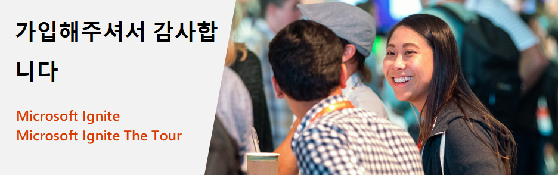

# Microsoft Ignite and Microsoft Ignite The Tour: Free Certification Exam Offer

<em><strong>2020년 3월 26일 업데이트됨</strong> 코로나바이러스(COVID-19)에 대응하여 Microsoft는 시험 제안을 2021년 1월 31일까지 연장합니다. 즉, 이벤트에 따라 180일 동안 유효했던 인증 시험 제안이 이제 2021년 1월 31일까지 유효합니다. <a href="https://aka.ms/covid-19certannoucement">자세히 알아보기</a>. 이 변경 사항은 아래 세부 사항에 반영됩니다.</em>

Microsoft Ignite 2019 또는 Microsoft Ignite The Tour 2019-2020 이벤트에 참석해 주셔서 감사합니다. 이벤트에 직접 참가한 모든 참석자에게는 [사용 약관](#Terms-and-conditions)에 따라 계속해서 기술을 익히고 직원과 동료들에게 자신의 기술 전문 지식을 입증하는 데 도움이 되는 무료 인증 시험이 제공됩니다.

## 제안 세부 사항

Microsoft Ignite 2019 또는 Microsoft Ignite The Tour 2019-2020 이벤트에 직접 참가한 경우 1회의 Microsoft Fundamentals, 역할 기반 또는 전문 인증 시험을 무료로 받을 수 있습니다. 무료 시험 제안은 참가한 이벤트가 시작될 때부터 상환 가능하며, 2021년 1월 31일까지 유효합니다. 해당 기간 내에 자격 시험을 예약하지 않고 참석하지 않으면 제안을 상환할 수 없습니다.  

##  무료 시험 청구 방법

다음은 무료 시험을 청구하는 방법에 대한 단계별 지침입니다.

**1 단계:** [자격 시험](#eligible-exams-for-this-offer)을 선택하고 "시험 예약" 버튼을 클릭하여 온라인 등록 프로세스를 시작합니다.  

**2 단계:** 기존 Microsoft 인증 프로필에 로그인하거나 Microsoft 계정을 사용하여 인증 프로필을 만듭니다.  

**3 단계:** 로그인한 후 인증 프로필의 세부 정보가 정확한지 확인합니다.  

**4 단계:** 인증 프로필 페이지 하단에 있는 “저장하고 계속” 버튼을 클릭하여 ‘시험 할인’ 페이지로 이동합니다.  

**5 단계:** “시험 할인” 페이지에서 이벤트 등록에 사용한 이메일을 입력합니다. (예: alias@company.com 또는 alias@outlook.com).  

**6 단계:** 시험 할인을 받을 수 있는 자격이 있는 경우 입력한 주소로 확인 이메일을 받게 됩니다. 계속하려면 이메일로 받은 암호를 입력해야 합니다. 이메일을 받지 못한 경우 코드를 다시 보낼 수 있습니다.  

**7 단계:** 올바른 암호를 입력한 후 계정을 연결해야 합니다. 할인을 받으려면 계정 연결에 동의해야 합니다.  

다음번 로그인 시 계정 중 하나로 시험 할인을 받을 수 있는 자격이 있는 경우 할인이 자동으로 표시됩니다. 계정을 삭제하려면 [인증 대시보드](https://aka.ms/certdashboard)로 이동하여 “인증 프로필 편집”을 클릭합니다.

**8 단계:** 상단에 할인 팝업이 표시됩니다. 청구하려는 할인을 선택하고 예약한 시험 버튼을 클릭하여 구매를 계속합니다.  

**9 단계:** 후속 화면의 단계를 따라 시험을 예약하는 데 필요한 세부 정보를 제공합니다. 구매 과정에서 총 결제 금액이 0.00 달러 인지 확인하고 주문을 제출합니다.  

**인증 지원:**

시험 예약에 문제가 있는 경우 [Microsoft 인증 지원 포럼](https://trainingsupport.microsoft.com/mcp/forum?sort=LastReplyDate&dir=Desc&tab=All&status=all&mod=&modAge=&advFil=&postedAfter=&postedBefore=&threadType=All&isFilterExpanded=false&page=1) 에서 도움을 받으십시오. 포럼의 조정자는 업무일 하루만에 응답할 것입니다.

##  이 제안에 대한 적격 시험

이 제안에는 모든 Microsoft Fundamentals, 역할 기반 및 전문 인증 시험이 포함됩니다. 아래에 자격 있는 시험을 나열했습니다.

| 제품별 | 시험 |
| --- | --- |
| Azure | [AI-100: Designing and Implementing an Azure AI Solution](/learn/certifications/exams/ai-100) [AI-900: Microsoft Azure AI Fundamentals](/learn/certifications/exams/ai-900) [AZ-103: Microsoft Azure Administrator](/learn/certifications/exams/az-103) [AZ-104: Microsoft Azure Administrator (새 버전)](/learn/certifications/exams/az-104) [AZ-120: Planning and Administering Microsoft Azure for SAP Workloads](/learn/certifications/exams/az-120) [AZ-203: Developing Solutions for Microsoft Azure](/learn/certifications/exams/az-203) [AZ-204: Developing Solutions for Microsoft Azure (새 버전)](/learn/certifications/exams/az-204) [AZ-220: Microsoft Azure IoT Developer](/learn/certifications/exams/az-220) [AZ-300: Microsoft Azure Architect Technologies](/learn/certifications/exams/az-300) [AZ-301: Microsoft Azure Architect Design](/learn/certifications/exams/az-301) [AZ-400: Designing and Implementing Microsoft DevOps Solutions](/learn/certifications/exams/az-400) [AZ-500: Microsoft Azure Security Technologies](/learn/certifications/exams/az-500) [AZ-900: Microsoft Azure Fundamentals](/learn/certifications/exams/az-900) [DA-100: Analyzing Data with Microsoft Power BI](/learn/certifications/exams/da-100) [DP-100: Designing and Implementing a Data Science Solution on Azure](/learn/certifications/exams/dp-100) [DP-200: Implementing an Azure Data Solution](/learn/certifications/exams/dp-200) [DP-201: Designing an Azure Data Solution](/learn/certifications/exams/dp-201) [DP-300: Administering Relational Databases on Microsoft Azure](/learn/certifications/exams/dp-300) [DP-900: Microsoft Azure Data Fundamentals](/learn/certifications/exams/dp-900) |
| Dynamics 365 and Power Platform | [MB-200: Microsoft Power Platform + Dynamics 365 Core](/learn/certifications/exams/mb-200) [MB-210: Microsoft Dynamics 365 Sales](/learn/certifications/exams/mb-210) [MB-220: Microsoft Dynamics 365 Marketing](/learn/certifications/exams/mb-220) [MB-230: Microsoft Dynamics 365 Customer Service](/learn/certifications/exams/mb-230) [MB-240: Microsoft Dynamics 365 Field Service](/learn/certifications/exams/mb-240) [MB-300: Microsoft Dynamics 365: Core Finance and Operations](/learn/certifications/exams/mb-300) [MB-310: Microsoft Dynamics 365 Finance](/learn/certifications/exams/mb-310) [MB-320: Microsoft Dynamics 365 Supply Chain Management, Manufacturing](/learn/certifications/exams/mb-320) [MB-330: Microsoft Dynamics 365 Supply Chain Management](/learn/certifications/exams/mb-330) [MB-400: Microsoft Power Apps + Dynamics 365 Developer](/learn/certifications/exams/mb-400) [MB-500: Microsoft Dynamics 365: Finance and Operations Apps Developer](/learn/certifications/exams/mb-500) [MB-600: Microsoft Dynamics 365 + Power Platform Solution Architect](/learn/certifications/exams/mb-600) [MB-700: Microsoft Dynamics 365: Finance and Operations Apps Solution Architect](/learn/certifications/exams/mb-700) [MB-901: Microsoft Dynamics 365 Fundamentals](/learn/certifications/exams/mb-901) [PL-900: Microsoft Power Platform Fundamentals](/learn/certifications/exams/pl-900) |
| Microsoft 365 | [MD-100: Windows 10](/learn/certifications/exams/md-100) [MD-101: Managing Modern Desktops](/learn/certifications/exams/md-101) [MS-100: Microsoft 365 Identity and Services](/learn/certifications/exams/ms-100) [MS-101: Microsoft 365 Mobility and Security](/learn/certifications/exams/ms-101) [MS-200: Planning and Configuring a Messaging Platform](/learn/certifications/exams/ms-200) [MS-201: Implementing a Hybrid and Secure Messaging Platform](/learn/certifications/exams/ms-201) [MS-203: Microsoft 365 Messaging](/learn/certifications/exams/ms-203) [MS-300: Deploying Microsoft 365 Teamwork](/learn/certifications/exams/ms-300) [MS-301: Deploying SharePoint Server Hybrid](/learn/certifications/exams/ms-301) [MS-500: Microsoft 365 Security Administration](/learn/certifications/exams/ms-500) [MS-600: Building Applications and Solutions with Microsoft 365 Core Services](/learn/certifications/exams/ms-600) [MS-700: Managing Microsoft Teams](/learn/certifications/exams/ms-700) [MS-900: Microsoft 365 Fundamentals](/learn/certifications/exams/ms-900) |

## FAQ

### 제안 정보

**질문: 이 제안으로 몇 개의 시험을 무료로 예약할 수 있습니까?**

**답변:** 이 제안을 통해 자격 증명 시험 하나를 무료로 신청할 수 있습니다. Microsoft Ignite 이벤트에 여러 번 참석하더라도 본 제안에는 무료로 응시할 수 있는 시험이 하나 있습니다.

**질문: 이 제안에 적합한 인증 시험은 무엇입니까?**

**답변:** 이 제안에는 모든 Microsoft Fundamentals, 역할 기반 및 전문 인증 시험이 포함됩니다. 자격 인증 시험 목록은 다음 당사의 제안 세부 정보 페이지에서 "본 제안에 대한 적격 시험" 섹션을 참조하십시오. [https://docs.microsoft.com/learn/certifications/microsoft-ignite-free-certification-exam-offer#eligible-exams-for-this-offer](https://docs.microsoft.com/learn/certifications/microsoft-ignite-free-certification-exam-offer#eligible-exams-for-this-offer).

**질문: 자격이 있는 이벤트에 등록했지만 직접 참가하지 않은 경우에도 이 제안을 청구할 수 있습니까?**

**답변:** 아니오, 이 제안은 Microsoft Ignite 2019 또는 Microsofy Ignite The Tour 2019-2020 행사에 직접 참석한 사람에게만 유효합니다.

**질문: 자격이 있는 이벤트에 등록했는데 이벤트가 취소된 경우 여전히 본 제안을 청구할 수 있습니까?**

**답변:** 아니요. 인증 시험 제안은 현장 체험의 연장선상에 있으며, 이벤트가 취소되면 인증 시험 제안을 사용할 수 없습니다. 그렇지만 [Microsoft Learn](https://docs.microsoft.com/learn/)!)에서 무료로 제공되는 대화형 교육을 통해 계속 학습할 것을 권장합니다.

**질문: 왜 사용 약관에서 이스라엘, 독일 또는 스웨덴 거주자들은 자격 대상이 아닌 것으로 규정했습니까?**

**답변:** 본 국가 거주자는 Microsoft의 증정 정책 및 현지 법으로 인해 제안을 제공할 수 없습니다. 해당 국가에서는 어떤 회사든 주민들에게 주는 선물을 제한하는 구체적인 법이 있고, 우리의 인증 시험의 가치는 한계를 넘어서고 있기 때문에 Microsoft는 이러한 국가 주민들에게 무료 시험을 제공할 수 없습니다.

### 무료 시험 일정 예약하기

**질문: 이미 참석했거나 참석할 예정인 이벤트 기간 동안에만 이 제안으로 무료 시험을 예약할 수 있나요?**

**답변:** 아니오, 참석하신 이벤트 기간 내에 이 제안으로 무료 시험을 예약하지 않아도 됩니다. 이벤트 도중 또는 이벤트 후에 시험을 예약할 수 있습니다. 무료 시험 응시 제안은 2021년 1월 31일 만료됩니다.

**질문: 2021년 1월 31일 이전에 시험을 치러야 하나요?**

**답변:** 네. 2021년 1월 31일 이전에 시험을 치러야 합니다.

**질문: 이 제안에서 무료 시험을 어떻게 예약합니까?**

**답변:** 무료 시험을 예약하는 방법은 [https://docs.microsoft.com/learn/certifications/microsoft-ignite-free-certification-exam-offer#how-to-claim-your-free-exam](https://docs.microsoft.com/learn/certifications/microsoft-ignite-free-certification-exam-offer#how-to-claim-your-free-exam) 을 참조하십시오.

**질문: 시험 할인 자격을 확인하는 도중 공무원이 아닌데도 공무원이라는 이유로 자격이 없다고 뜹니다. 어떻게 해야 하죠?**

**답변:** 신원을 공무원으로 잘못 인식하는 경우, 이벤트 등록 프로필에서 정부 입력란을 업데이트하고 이벤트가 종료된 후 자격 여부를 확인할 수 있습니다. [Microsoft 인증 지원 포럼](https://trainingsupport.microsoft.com/mcp/forum?sort=LastReplyDate&dir=Desc&tab=All&status=all&mod=&modAge=&advFil=&postedAfter=&postedBefore=&threadType=All&isFilterExpanded=false&page=1) ([https://aka.ms/CertificationSupport](https://aka.ms/CertificationSupport))에 연계하여 도움을 청하실 수도 있습니다.

**질문: 무료 시험 예약에 문제가 있습니다. 어디서 지원을 받을 수 있습니까?**

**답변:** [Microsoft 인증 지원 포럼](https://trainingsupport.microsoft.com/mcp/forum?sort=LastReplyDate&dir=Desc&tab=All&status=all&mod=&modAge=&advFil=&postedAfter=&postedBefore=&threadType=All&isFilterExpanded=false&page=1) ([https://aka.ms/CertificationSupport](https://aka.ms/CertificationSupport))를 통해 도움을 받을 수 있습니다. 조정자는 업무일 하루만에 응답할 것입니다.

**질문: 예약된 시험을 직접 보거나 온라인으로 응시할 수 있는 옵션이 있습니까?**

**답변:** 예, 로컬 테스트 센터에서 Pearson Vue를 직접 보거나 OP(온라인 감독)를 통해 예약된 시험을 치를 수 있습니다. 온라인 시험에 대해 자세히 알아보려면 다음 웹 사이트를 방문하세요.
[https://docs.microsoft.com/learn/certifications/online-exams](/learn/certifications/online-exams)

### 취소 및 일정 조정 정책

**질문: 필요한 경우 이 제안에서 시험 일정을 변경할 수 있습니까?**

**답변:** 예, 시험 일정을 변경할 수 있지만 제안 만료 전에 해야 합니다. 자세한 정보를 보시려면 [일정 조정 정책을 참조하세요](/learn/certifications/certification-exam-policies#cancellation-and-reschedule-policy).

**질문: 시험 일정을 변경하거나 예약을 취소할 경우 수수료가 부과되나요?**

**답변:** 예약일 기준 최소 6일 전에 시험 일정을 변경하거나 취소하면 수수료가 부과되지 않습니다. 시험 시간까지 영업일 기준으로 5일 남아있고 일정을 변경해야 하는 경우, 일정 조정 수수료를 지불해야 합니다. 예약된 시험 시간이 2일 남은 경우, 시험 일정을 변경하거나 취소할 수 없습니다. 시험을 치르지 않으면 제공된 무료 시험 자격이 박탈됩니다. 자세한 내용은 [취소 및 일정 변경 정책](/learn/certifications/certification-exam-policies#cancellation-and-reschedule-policy)을 참조하세요.

**질문: 예약한 시험을 치르지 않고 일정을 변경하거나 취소하지 않은 경우에는 어떻게 되나요?**

**답변:** 예약일 기준 24시간 이전에 시험 일정을 변경하거나 취소하지 않고 예약한 시험에 응시하지 않은 경우, 무료 시험 자격이 박탈됩니다. 자세한 내용은 [취소 및 일정 변경 정책](/learn/certifications/certification-exam-policies#cancellation-and-reschedule-policy)을 참조하세요.

### 재응시 정책

**질문: 무료 인증 시험 제안을 사용하여 응시한 첫 번째 시험에 불합격한 경우 무료로 시험에 재응시할 수 있나요?**

**답변:** 아니요. 이 제안은 한 번만 시도할 수 있으며, 시험 재응시는 별도로 예약해야 합니다. 인증 시험 재응시에 대한 자세한 내용은 [시험 재응시 정책](/learn/certifications/certification-exam-policies#security-policies)을 참조하십시오.

##  사용 약관

- 본 시험 제안은 공식 Microsoft Ignite 2019 또는 Microsoft Ignite The Tour 2019-2020 이벤트에 참가한 개인에게 제공됩니다.
- 이 시험 제안은 공인 Pearson Vue 테스트 센터 또는 Pearson Vue 온라인 감독 사이트를 통해 제공되는 (1)개의 Microsoft 인증 시험을 치르는 데 사용할 수 있습니다.
- 이 시험 제안은 시험마다 다르며 Microsoft 시험 선택에만 사용할 수 있습니다.
- 이 시험 제안은 이 시험 제안을 받은 첫날부터 시작하여 2021년 1월 31일까지 사용할 수 있습니다.
- 본 시험 제안은 제안 만료일 전에 1회 시험에만 응시하고 참가할 수 있는 자격을 부여합니다.
- 이 시험 제안의 만료일은 어떠한 경우에도 연장할 수 없습니다.
- 본 시험 제공은 시험자가 다음의 어느 하나에 해당하는 경우 유효하지 않으며 상환될 수 없습니다. 1) 국가 공무원; 또는 2) 이스라엘, 독일 또는 스웨덴의 거주자.  * 본 제안은 Microsoft 정책 및 지역법에 따라 허용 가능한 범위를 벗어난 정부 당국자나 앞서 공지한 거주자에게 제공되지 않습니다.
- 이 시험 제안은 한 번만 제공될 수 있습니다. 
- 이 시험 제안은 상환되거나 현금, 신용 또는 환불로 교환할 수 없습니다.
- 이 시험 제안은 양도할 수 없으며 변경, 수정 또는 양도할 경우 무효가 됩니다.

자세한 내용은 전체 [Microsoft 사용 약관](https://www.microsoft.com/en-us/legal/intellectualproperty/copyright/default.aspx?SilentAuth=1)을 참조하시기 바랍니다.
